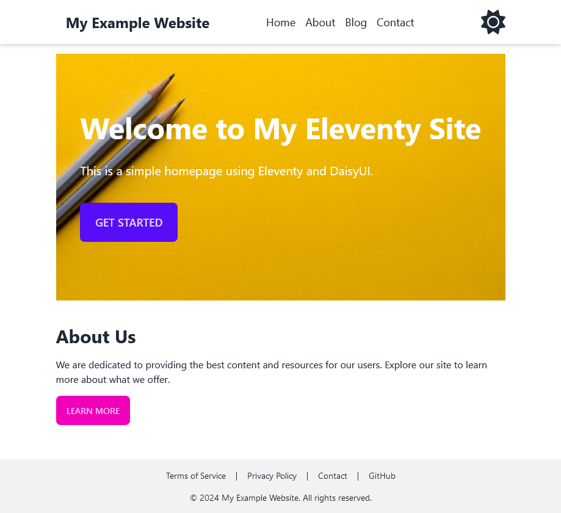
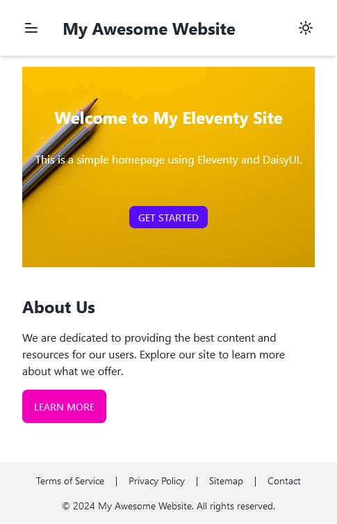

# Eleventy-DaisyUI-Template
A custom responsive template for Eleventy 3 using DaisyUI.

## Other custom features
- Custom 404 page
- Automatic copyright year - never have to update it again
- Theme control with DaisyUI, and a theme switcher
- About page
- Demo terms of service and privacy policy pages
- Demo contact form page
- Mobile support in the header
- Blog support
- Scheduling blog posts and drafts
- Fontawesome icons
- Accessibility improvements
- Automatic sitemap generation
- RSS/Atom feed

## How to use this template
1. Clone this repository
2. Run `npm install`
3. Modify the content in the `src` folder - be sure to update the `_data/site.json5` file with your site's information
4. Run `npm start` to start the development server and test your changes
5. Run `npm run build` to build the project - the output will be in the `_site` folder

### More information

### How to use the blog
1. Go into the `_data/site.json5` file and make sure the `blog` value is set to `true`
2. Create a new markdown file in the `blog` folder
3. Add the following front matter to the file:
```markdown
---
title: "First Blog Post"
date: 2023-10-01
author: "John Doe"
layout: blogPost.njk
---
```
4. Add your content below the front matter, this will be the content of your blog post
5. Repeat steps 2-4 for each blog post you want to add

## Screenshots
### Homepage


### Mobile


## License
This project is licensed under the MIT License - see the [LICENSE](LICENSE.md) file for details.

## Authors
- [Eli Carenza](https://github.com/elicarenza)

## Acknowledgements
- [Eleventy](https://www.11ty.dev/)
- [DaisyUI](https://daisyui.com/)
- [Font Awesome](https://fontawesome.com/)
- [Tailwind CSS](https://tailwindcss.com/)

## Changelog

### 3.0.0
- Upgrades to DaisyUI 5.0.9 - see [release notes](https://daisyui.com/docs/v5/)
- Upgrades to TailwindCSS 4.0.17 - see [Tailwind CSS 4 breaking changes](https://tailwindcss.com/docs/upgrade-guide#changes-from-v3)
- Adds a custom CoPilot configuration file for more accurate suggestions within VSCode

### 2.1.0
- Upgrades packages to resolve security vulnerabilities
- Adds the RSS feed link inside of the head tag for better visibility of the link to RSS Feed readers

### 2.0.2
- Minor fix regarding the theming

### 2.0.1
- Fixes a bug by replacing directional rules with logical CSS properties instead, according to DaisyUI update 4.x

### 2.0.0
- Update to Eleventy 3.0.0
- Update to DaisyUI 4.12.13
- Add RSS/Atom feed

Eleventy 3 release notes: https://github.com/11ty/eleventy/releases/tag/v3.0.0

DaisyUI 4 release notes: https://daisyui.com/docs/changelog/
We upgraded from 3.x to 4.x, so be sure to check the 4.0.0 changelog for any breaking changes.

The Atom feed is available at `/feed.xml` and pulls data from the main data file, `_data/site.json5`. The feed includes the title, description, and URL of the site, as well as the title, description, and URL of each blog post.

### 1.5.0
- Add blog scheduling and drafts
- Cleanup the Eleventy config file

### 1.4.0
- Add sitemap generation

### 1.3.1
- Update theme toggle to use DaisyUI component

### 1.3.0
- Add Fontawesome icons
- Accessibility improvements
- Example Terms of Service and Privacy Policy pages

### 1.2.0
- Add about page
- Add demo contact form page

### 1.1.0
- Better mobile support in the header
- Fix the blog post list template
- Add a "back to the blog" breadcrumb to the blog post template

### 1.0.0
- Initial release
